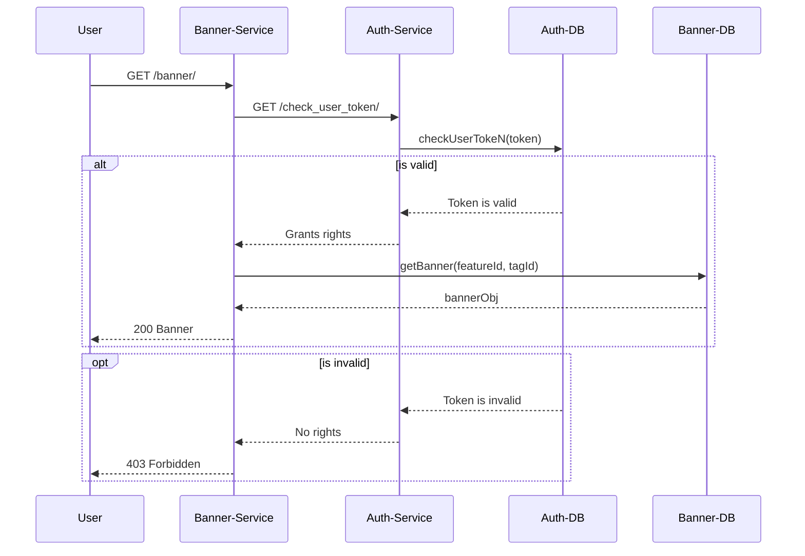

# Banners Service
## Описание проекта
Проект представляет собой сервис, выполнящий задачу вывода баннеров с контентом для пользователей, 
в зависимости от требуемой фичи и тега. 
Проект составлен в соответсвии с заданием:
``https://github.com/avito-tech/backend-trainee-assignment-2024?tab=readme-ov-file``

В данном файле будет описано решение поставленной задачи и собственный ход мыслей: как я понял задачу, какие варианты 
рассматривал. В пакетах проекта представлю локальные README-файлы, описывающие слой приложения и какие задачи он
выполняет.
## Ход мыслей
### Решение задачи по быстрому доступа пользователя к баннеру
Главной задачей я видел обеспечение быстрого доступа к баннерам. Постоянно обращаться в базу данных с учётом 
предварительной проверки токенов - задача по времени затратная, а условие требует быстрого ответа от сервера. Вывод: 
надо воспользоваться другой особенностью разрабатываемого приложения - небольшое число фичей и тегов. А значит можно
воспользоваться технологией кеширования и разместить самые востребованные баннеры в оперативной памяти. Был выбран 
подход cache ahead, принцип работы которого представлен на рисунке ниже.


Все созданные или обновлённые баннеры сначала сохраняются в БД. Раз в 5 минут, данные из БД переносятся в кеш. В период
этого окна, пользователь может получить устаревшую версию баннера. Если запрос пользователя содержит флаг актуальности, 
то запрос отправляется в БД. За выгрузку данных из БД в кеш отвечает модуль Cron, асинхронно раз в 5 минут копирующий 
данные из БД в кеш.

В самой реляционной БД между сущностями баннера и фичей связь _Один-ко-Многим_, а между баннером и тегом
_Многие-ко-Многим_. Поиск в базе можно оптимизировать созданием индексов, но если запрос пользователя содержит флаг 
актуальности, то зачастую такой запрос будет выполняться дольше. 

Второй вопрос: хранение данных в оперативной памяти. Для этого была использована библиотека
 ``https://github.com/hashicorp/golang-lru/``, которая по сути представляет собой надстройку над стандартной мапой, 
делая её потокобезопасной и внедряя алгоритм LRU для удаления редкоиспользуемых записей. Так как в основе лежит мапа, то
и поиск записей проводится в соответствии с алгоритмами поиска по мапе. Если в качестве ключа выбрать ID банннера, то 
поиск в худшем случае будет занимать *_O(N x M)_*, где N - количество баннеров в кеше, M - количество тегов, при условии,
что каждый тэг составляет пару каждой фиче, пораждая при этом уникальную запись баннера. 

Важным условием задачи является то, что пара ID тега и фичи определяет баннер, а значит представляю собой своего рода 
уникальный идентификатор. В качестве ключа в мапе можно определить _comparable_ структуру, содержащую в себе ID фичи и 
тега.

```
type FeatureTag struct {
    FeatureId int
    TagId     int
}
```
Получение значения по ключу принято считать за *_O(1)_*, но в случае плохого распределения ключей в мапе и, как 
следствие, возникновение большего числа коллизий и порождение большего количество бакетов, практическое время поиска 
будет так же больше.

```
type BannerCache struct {
     cache *lru.LRU[FeatureTag, *app.Banner]
}
```
Минусом такого подхода является дублирование данных. Приходится хранить информацию о фиче и тегах и в структуре баннера,
и в качестве ключей. С момента копирования данных из БД в кеш, размер может мапы может достигать до *_N x M_* (в случае 
если каждая фича сопоставляется с тегом тем самым порождая уникальный баннер), а объём вариьируется в зависимости от 
содержимого контента. Баннеры по идее должны быть вспомогательным функционалом приложения, и вряд ли будут содержать в 
себе информацию большого размера, но лучше предусмотреть ограничение доступной оперативной памяти в виртуальном 
пространстве приложения. Но опять же, это является крайним исключительным случаем. Как я понял, в контексте 
веб-приложения в целом, сервис баннеров может быть развернуть в нескольких экземплярах, что позволит распределить 
нагрузку и сохранить при этом скорость отправки баннеров пользователю.

### Аутентификация
Касамо момента проверки токена, как я понял, за авторизацию и аутентификацию отвечает сторонний сервис. Схематично, 
сценарий получения баннера пользователем я вижу следующим образом. 


В рамках разработки сервиса, я хотел представить сервис авторизации в качестве mock-сервера на базе Postman, но по 
какой-то причине лимит запросов на mock-api был израсходован (все 1000). Поэтому, пока добавил mock-ответ в приложении. 
Позже интегрирую Postman, как только число запросов обновится, или если обновится.
### Создание, обновление и валидация
В реализации функционала по созданию и обновлению сущностей баннеров, меня смутил один момент. На практике, вряд ли 
администратор сервиса помнит все связи тегов и фич и какие баннеры в результате получаются. Вопрос: какова вероятность,
что админ создаст новый баннер на основе связей уже существующего баннера? Или создаст связь, которая будет такой же как
и у другого баннера? 

*Какое решения я предложил бы команде.* Расширить API создания и обновления. Добавить код возможный код ошибки 409 
Conflict. На уровне репозитория делается предварительный запрос по поиску баннера по ID фичи и тега. Если такой баннер 
уже существуют, то вернуть ошибку. В обратном случае, создать/обновить баннер. Так как поставленная задача 
предусматривает расширение API только в одном случае (контроль версий баннеров), думаю, правильным решением будет 
только упомянуть об этом моменте в рамках выполнения.